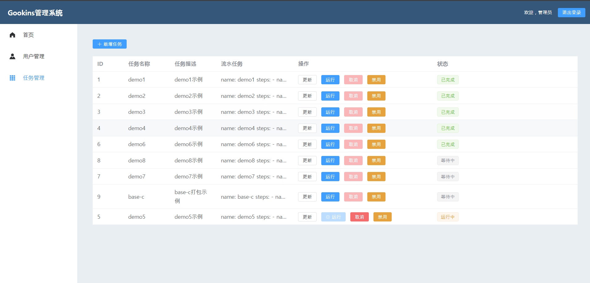

### gookins

* **开发**
1. 项目根目录下: swag init . && go build  
2. swagger: http://192.168.165.89:8084/swagger/index.html  

* **构建**
1. 前端: npm run build  
2. 同步资源文件 web/dist/* 到 statics/ 下  
3. 编译: go build

* 
